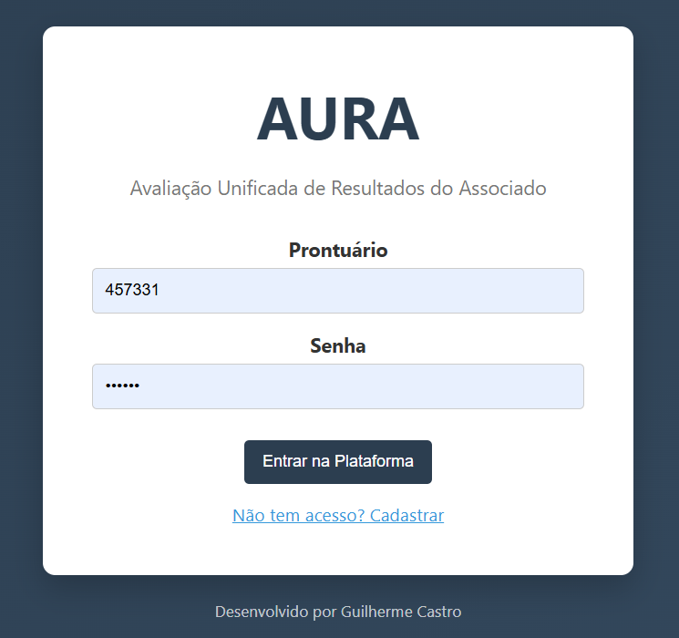
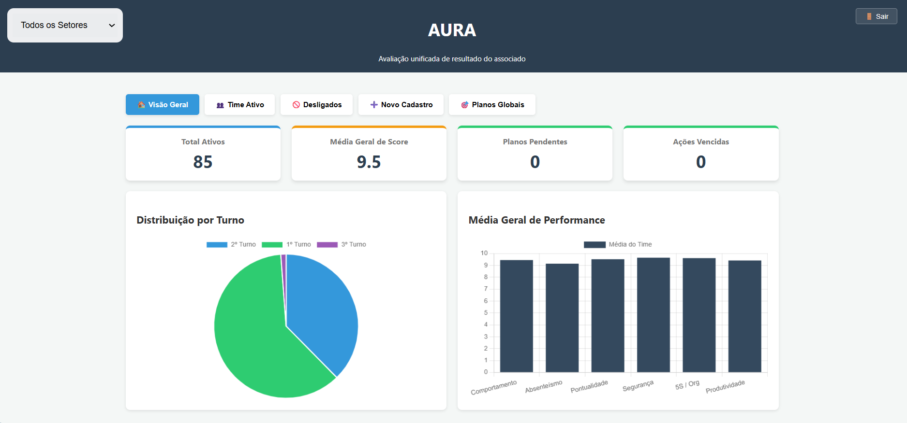
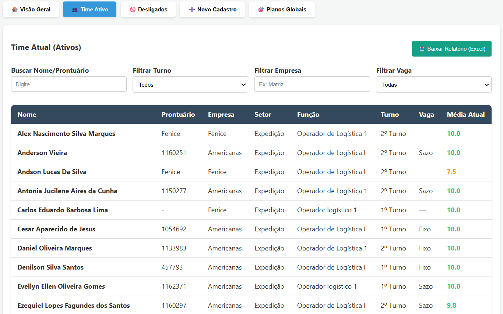
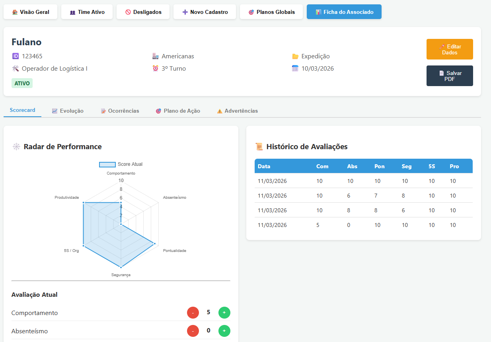

# 🧠 AURA  
### Avaliação Unificada de Resultados do Associado

  <b>Plataforma completa para gestão de desempenho, análise comportamental e tomada de decisão baseada em dados.</b>

  
  
  

---

## 📌 Sobre o Projeto

O **AURA** é um sistema web desenvolvido para **monitorar, avaliar e evoluir o desempenho de colaboradores** dentro de uma operação.

A plataforma centraliza informações críticas como:

- Performance individual  
- Histórico comportamental  
- Ocorrências operacionais  
- Planos de ação estratégicos  

Tudo isso em um **dashboard intuitivo e orientado a dados**.

---

## 🎯 Objetivo

Transformar a gestão de pessoas em um processo:

- 📊 Data-driven  
- ⚡ Ágil  
- 📈 Mensurável  
- 🎯 Estratégico  

---

## 🖥️ Preview do Sistema

---

## ⚙️ Funcionalidades Principais

🔐 **Autenticação Inteligente**

- Login e cadastro com validação por prontuário

- Integração com Firebase Authentication

---

📊 **Dashboard Executivo**

- KPIs em tempo real:

- Total de ativos

- Média de performance

- Ações pendentes

- Ações vencidas

- Gráficos com Chart.js

---

👥 **Gestão de Colaboradores**

- Cadastro completo

- Filtros avançados

- Controle de status (ativo / desligado)

---

🧠 **Avaliação de Performance**

Métricas avaliadas:

- Comportamento

- Absenteísmo

- Pontualidade

- Segurança

- 5S

- Produtividade

✔ Score dinâmico
✔ Radar de performance
✔ Histórico evolutivo

---

📈 **Análise de Evolução**

- Gráficos por período

- Tendência de desempenho

- Correlação com ocorrências

---

📝 **Ocorrências**

- Feedbacks

- Faltas:

  - Justificadas (com CID)

  - Injustificadas

---

⚠️ **Advertências**

Tipos:

- Atrasos

- Erro operacional

- Falta injustificada

- Comportamental

Níveis:

- Verbal

- Escrita

---

🎯 **Planos de Ação**

- Criação por métrica

- Responsável + prazo

- Status:

  - Pendente

  - Concluído

✔ Dashboard global

---

📄 **Exportações**

- Excel (CSV)

- PDF

## 🧱 Estrutura do Projeto

AURA/
│
├── index.html
├── styles
├── scripts
└── firebase

---

## 🛠️ Tecnologias

**Frontend**

- HTML5

- CSS3

- JavaScript

Bibliotecas

- Chart.js

- SweetAlert2

- html2pdf.js

**Backend**

- Firebase Authentication

- Firebase Firestore

## 🔥 Diferenciais

- JavaScript puro (sem framework)

- Firebase em tempo real

- Dashboard analítico completo